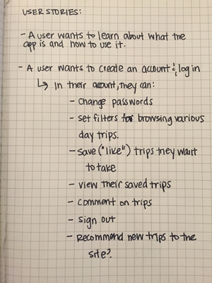
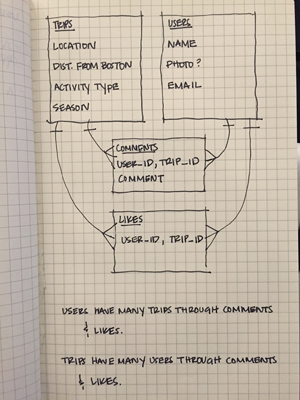
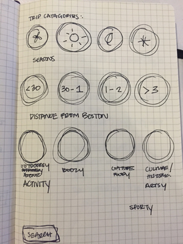

# Boston Day Trips App

[https://jenboyd.github.io/boston-day-trips-client/](Boston Day Trips)

This app was created for General Assembly's WDI Full Stack App Project. The
repo for the API designed for this project is located[https://github.com/jenboyd/boston-day-trips-api](here).

The concept for this project is to create an app that allows users to more
easily find days trips within the Boston area. They are able to sign in and
search through a database of day trips, comment on those trips, and view
comments from other users. I used the following technologies to create the
client for Boston Day Trips:

   - HTML / CSS
   - SASS
   - Javascript
   - Jquery
   - Handlebars

## Wireframes & User Stories

##Next Steps

   - Populate the Trips table with more data.
   - Add the ability for Users to filter trips based on information already
      set up in the database about the distance from Boston, seasons, and
      type of activity.
  - Improve functionailty of comments. Comment associate with a trip should
      show up on a trip's view and should be refreshed automatically when a new
      one is added.
  - Add error messages where appropriate when user's attempt something not
      supported by the API.
